# Modelamiento de los datos. 
Asi se guardaran los datos en la base de datos, esto esta sujeto a cambio

## AUTENTICACIÓN Y USUARIOS 

TABLE: usuarios
- id (UUID, PK)
- email (VARCHAR, UNIQUE, NOT NULL)
- password (VARCHAR, NOT NULL) [hasheada con BCrypt]
- nombre (VARCHAR, NOT NULL)
- apellido (VARCHAR, NOT NULL)
- activo (BOOLEAN, DEFAULT true)
- fecha_creacion (TIMESTAMP, DEFAULT NOW())
- fecha_actualizacion (TIMESTAMP, DEFAULT NOW())

TABLE: roles
- id (UUID, PK)
- nombre (VARCHAR, UNIQUE, NOT NULL) [ADMIN, MODERATOR, VOLUNTEER, USER]
- descripcion (TEXT)
- fecha_creacion (TIMESTAMP, DEFAULT NOW())

TABLE: permisos
- id (UUID, PK)
- nombre (VARCHAR, UNIQUE, NOT NULL) [CREATE_COURSE, EDIT_ACTIVITY, etc]
- descripcion (TEXT)
- modulo (VARCHAR) [COURSES, ACTIVITIES, USERS, etc]
- fecha_creacion (TIMESTAMP, DEFAULT NOW())

TABLE: usuarios_roles [many-to-many]
- usuario_id (FK -> usuarios.id)
- rol_id (FK -> roles.id)
- PK: (usuario_id, rol_id)

TABLE: roles_permisos [many-to-many]
- rol_id (FK -> roles.id)
- permiso_id (FK -> permisos.id)
- PK: (rol_id, permiso_id)

## CONTENIDO PRINCIPAL 

TABLE: categorias
- id (UUID, PK)
- nombre (VARCHAR, UNIQUE, NOT NULL)
- descripcion (TEXT)
- icono (VARCHAR)
- color (VARCHAR)
- tipo (VARCHAR) [ASESORIA, CURSO, ACTIVIDAD, GENERAL]
- fecha_creacion (TIMESTAMP, DEFAULT NOW())

TABLE: ubicaciones
- id (UUID, PK)
- nombre (VARCHAR, NOT NULL)
- direccion (VARCHAR)
- ciudad (VARCHAR)
- latitud (DECIMAL, NULLABLE)
- longitud (DECIMAL, NULLABLE)
- fecha_creacion (TIMESTAMP, DEFAULT NOW())

TABLE: asesorias
- id (UUID, PK)
- titulo (VARCHAR, NOT NULL)
- categoria_id (FK -> categorias.id)
- definicion (TEXT, NOT NULL)
- objetivos (TEXT, NOT NULL)
- metodologia (TEXT, NOT NULL)
- imagen (VARCHAR)
- activo (BOOLEAN, DEFAULT true)
- orden (INTEGER)
- usuario_creador_id (FK -> usuarios.id)
- fecha_creacion (TIMESTAMP, DEFAULT NOW())
- fecha_actualizacion (TIMESTAMP, DEFAULT NOW())

TABLE: cursos_destacados
- id (UUID, PK)
- titulo (VARCHAR, NOT NULL)
- descripcion (TEXT, NOT NULL)
- eslogan (VARCHAR)
- objetivo (TEXT, NOT NULL)
- categoria_id (FK -> categorias.id)
- imagen (VARCHAR)
- activo (BOOLEAN, DEFAULT true)
- orden (INTEGER)
- enlace_inscripcion (VARCHAR)
- usuario_creador_id (FK -> usuarios.id)
- fecha_creacion (TIMESTAMP, DEFAULT NOW())
- fecha_actualizacion (TIMESTAMP, DEFAULT NOW())

TABLE: accion_joven
- id (UUID, PK)
- titulo (VARCHAR, NOT NULL)
- descripcion (TEXT, NOT NULL)
- imagen (VARCHAR)
- activo (BOOLEAN, DEFAULT true)
- usuario_creador_id (FK -> usuarios.id)
- fecha_creacion (TIMESTAMP, DEFAULT NOW())
- fecha_actualizacion (TIMESTAMP, DEFAULT NOW())

TABLE: programas
- id (UUID, PK)
- titulo (VARCHAR, NOT NULL)
- descripcion (TEXT, NOT NULL)
- definicion (TEXT, NOT NULL)
- objetivos (TEXT, NOT NULL)
- metodologia (TEXT, NOT NULL)
- imagen (VARCHAR)
- activo (BOOLEAN, DEFAULT true)
- orden (INTEGER)
- usuario_creador_id (FK -> usuarios.id)
- fecha_creacion (TIMESTAMP, DEFAULT NOW())
- fecha_actualizacion (TIMESTAMP, DEFAULT NOW())

TABLE: actividades_talleres
- id (UUID, PK)
- titulo (VARCHAR, NOT NULL)
- descripcion (TEXT, NOT NULL)
- categoria_id (FK -> categorias.id)
- fecha_hora (TIMESTAMP, NOT NULL)
- activo (BOOLEAN, DEFAULT true)
- cantidad_maxima_participantes (INTEGER)
- imagen (VARCHAR)
- ubicacion_id (FK -> ubicaciones.id)
- enlace_inscripcion (VARCHAR)
- inscritos (INTEGER, DEFAULT 0)
- estado (VARCHAR) [CONFIRMADO, PENDIENTE, CANCELADO]
- usuario_creador_id (FK -> usuarios.id)
- fecha_creacion (TIMESTAMP, DEFAULT NOW())
- fecha_actualizacion (TIMESTAMP, DEFAULT NOW())

TABLE: salud_mental
- id (UUID, PK)
- titulo (VARCHAR, NOT NULL)
- descripcion (TEXT)
- icono (VARCHAR)
- telefono (VARCHAR)
- enlace (VARCHAR)
- orden (INTEGER)

TABLE: tu_contribucion_cuenta
- id (UUID, PK)
- titulo (VARCHAR, NOT NULL)
- descripcion (TEXT, NOT NULL)
- link_google_forms (VARCHAR, NOT NULL)
- activo (BOOLEAN, DEFAULT true)
- fecha_actualizacion (TIMESTAMP, DEFAULT NOW())

## INSCRIPCIONES Y PARTICIPACIÓN 

TABLE: inscripciones
- id (UUID, PK)
- usuario_id (FK -> usuarios.id, NOT NULL)
- recurso_id (UUID, NOT NULL)
- tipo_recurso (VARCHAR) [ACTIVIDAD, CURSO, ASESORIA]
- fecha_inscripcion (TIMESTAMP, DEFAULT NOW())
- estado (VARCHAR) [INSCRITO, CANCELADO, ASISTIO, NO_ASISTIO]
- notas (TEXT, NULLABLE)

TABLE: galeria_fotos
- id (UUID, PK)
- actividad_id (FK -> actividades_talleres.id, NOT NULL)
- url_imagen (VARCHAR, NOT NULL)
- titulo (VARCHAR, NULLABLE)
- descripcion (TEXT, NULLABLE)
- orden (INTEGER)
- fecha_creacion (TIMESTAMP, DEFAULT NOW())

TABLE: resenas_calificaciones
- id (UUID, PK)
- usuario_id (FK -> usuarios.id, NOT NULL)
- recurso_id (UUID, NOT NULL)
- tipo_recurso (VARCHAR) [ACTIVIDAD, CURSO, ASESORIA]
- calificacion (INTEGER) [1-5]
- comentario (TEXT, NULLABLE)
- fecha_creacion (TIMESTAMP, DEFAULT NOW())

## CONTACTO Y COMUNICACIÓN

TABLE: contactos
- id (UUID, PK)
- nombre (VARCHAR, NOT NULL)
- email (VARCHAR, NOT NULL)
- telefono (VARCHAR, NULLABLE)
- mensaje (TEXT, NOT NULL)
- programa_interes (VARCHAR, NULLABLE)
- fecha_contacto (TIMESTAMP, DEFAULT NOW())
- respondido (BOOLEAN, DEFAULT false)
- respuesta (TEXT, NULLABLE)
- usuario_respondio_id (FK -> usuarios.id, NULLABLE)
- fecha_respuesta (TIMESTAMP, NULLABLE)

## AUDITORÍA Y ADMINISTRACIÓN 

TABLE: auditoria
- id (UUID, PK)
- entidad_tipo (VARCHAR) [ASESORIA, CURSO, ACTIVIDAD, PROGRAMA, USUARIO]
- entidad_id (UUID, NOT NULL)
- usuario_id (FK -> usuarios.id, NOT NULL)
- tipo_cambio (VARCHAR) [CREAR, EDITAR, ELIMINAR]
- cambios_anteriores (JSONB, NULLABLE)
- cambios_nuevos (JSONB, NULLABLE)
- fecha (TIMESTAMP, DEFAULT NOW())

TABLE: estadisticas
- id (UUID, PK)
- tipo_recurso (VARCHAR) [ASESORIA, CURSO, ACTIVIDAD, PROGRAMA]
- recurso_id (UUID, NOT NULL)
- total_inscritos (INTEGER, DEFAULT 0)
- total_asistentes (INTEGER, DEFAULT 0)
- total_resenas (INTEGER, DEFAULT 0)
- promedio_calificacion (DECIMAL(3,2), NULLABLE)
- fecha_actualizacion (TIMESTAMP, DEFAULT NOW())

## DER

```mermaid
erDiagram
    USUARIOS ||--o{ ROLES : tiene
    USUARIOS ||--o{ PERMISOS : tiene
    ROLES ||--o{ PERMISOS : tiene
    USUARIOS ||--o{ ASESORIAS : crea
    USUARIOS ||--o{ CURSOS_DESTACADOS : crea
    USUARIOS ||--o{ ACCION_JOVEN : crea
    USUARIOS ||--o{ PROGRAMAS : crea
    USUARIOS ||--o{ ACTIVIDADES_TALLERES : crea
    USUARIOS ||--o{ INSCRIPCIONES : realiza
    USUARIOS ||--o{ RESENAS_CALIFICACIONES : escribe
    USUARIOS ||--o{ CONTACTOS : envia
    USUARIOS ||--o{ AUDITORIA : registra
    
    CATEGORIAS ||--o{ ASESORIAS : clasifica
    CATEGORIAS ||--o{ CURSOS_DESTACADOS : clasifica
    CATEGORIAS ||--o{ ACTIVIDADES_TALLERES : clasifica
    
    UBICACIONES ||--o{ ACTIVIDADES_TALLERES : tiene
    
    ASESORIAS ||--o{ INSCRIPCIONES : tiene
    CURSOS_DESTACADOS ||--o{ INSCRIPCIONES : tiene
    ACTIVIDADES_TALLERES ||--o{ INSCRIPCIONES : tiene
    
    ACTIVIDADES_TALLERES ||--o{ GALERIA_FOTOS : contiene
    
    ASESORIAS ||--o{ RESENAS_CALIFICACIONES : recibe
    CURSOS_DESTACADOS ||--o{ RESENAS_CALIFICACIONES : recibe
    ACTIVIDADES_TALLERES ||--o{ RESENAS_CALIFICACIONES : recibe
    
    ASESORIAS ||--o{ ESTADISTICAS : mide
    CURSOS_DESTACADOS ||--o{ ESTADISTICAS : mide
    ACTIVIDADES_TALLERES ||--o{ ESTADISTICAS : mide
    PROGRAMAS ||--o{ ESTADISTICAS : mide

    USUARIOS {
        UUID id PK
        string email UK
        string password
        string nombre
        string apellido
        boolean activo
        timestamp fecha_creacion
        timestamp fecha_actualizacion
    }

    ROLES {
        UUID id PK
        string nombre UK
        text descripcion
        timestamp fecha_creacion
    }

    PERMISOS {
        UUID id PK
        string nombre UK
        text descripcion
        string modulo
        timestamp fecha_creacion
    }

    USUARIOS_ROLES {
        UUID usuario_id FK
        UUID rol_id FK
    }

    ROLES_PERMISOS {
        UUID rol_id FK
        UUID permiso_id FK
    }

    CATEGORIAS {
        UUID id PK
        string nombre UK
        text descripcion
        string icono
        string color
        string tipo
        timestamp fecha_creacion
    }

    UBICACIONES {
        UUID id PK
        string nombre
        string direccion
        string ciudad
        decimal latitud
        decimal longitud
        timestamp fecha_creacion
    }

    ASESORIAS {
        UUID id PK
        string titulo
        UUID categoria_id FK
        text definicion
        text objetivos
        text metodologia
        string imagen
        boolean activo
        integer orden
        UUID usuario_creador_id FK
        timestamp fecha_creacion
        timestamp fecha_actualizacion
    }

    CURSOS_DESTACADOS {
        UUID id PK
        string titulo
        text descripcion
        string eslogan
        text objetivo
        UUID categoria_id FK
        string imagen
        boolean activo
        integer orden
        string enlace_inscripcion
        UUID usuario_creador_id FK
        timestamp fecha_creacion
        timestamp fecha_actualizacion
    }

    ACCION_JOVEN {
        UUID id PK
        string titulo
        text descripcion
        string imagen
        boolean activo
        UUID usuario_creador_id FK
        timestamp fecha_creacion
        timestamp fecha_actualizacion
    }

    PROGRAMAS {
        UUID id PK
        string titulo
        text descripcion
        text definicion
        text objetivos
        text metodologia
        string imagen
        boolean activo
        integer orden
        UUID usuario_creador_id FK
        timestamp fecha_creacion
        timestamp fecha_actualizacion
    }

    ACTIVIDADES_TALLERES {
        UUID id PK
        string titulo
        text descripcion
        UUID categoria_id FK
        timestamp fecha_hora
        boolean activo
        integer cantidad_maxima_participantes
        string imagen
        UUID ubicacion_id FK
        string enlace_inscripcion
        integer inscritos
        string estado
        UUID usuario_creador_id FK
        timestamp fecha_creacion
        timestamp fecha_actualizacion
    }

    SALUD_MENTAL {
        UUID id PK
        string titulo
        text descripcion
        string icono
        string telefono
        string enlace
        integer orden
    }

    TU_CONTRIBUCION_CUENTA {
        UUID id PK
        string titulo
        text descripcion
        string link_google_forms
        boolean activo
        timestamp fecha_actualizacion
    }

    INSCRIPCIONES {
        UUID id PK
        UUID usuario_id FK
        UUID recurso_id
        string tipo_recurso
        timestamp fecha_inscripcion
        string estado
        text notas
    }

    GALERIA_FOTOS {
        UUID id PK
        UUID actividad_id FK
        string url_imagen
        string titulo
        text descripcion
        integer orden
        timestamp fecha_creacion
    }

    RESENAS_CALIFICACIONES {
        UUID id PK
        UUID usuario_id FK
        UUID recurso_id
        string tipo_recurso
        integer calificacion
        text comentario
        timestamp fecha_creacion
    }

    CONTACTOS {
        UUID id PK
        string nombre
        string email
        string telefono
        text mensaje
        string programa_interes
        timestamp fecha_contacto
        boolean respondido
        text respuesta
        UUID usuario_respondio_id FK
        timestamp fecha_respuesta
    }

    AUDITORIA {
        UUID id PK
        string entidad_tipo
        UUID entidad_id
        UUID usuario_id FK
        string tipo_cambio
        jsonb cambios_anteriores
        jsonb cambios_nuevos
        timestamp fecha
    }

    ESTADISTICAS {
        UUID id PK
        string tipo_recurso
        UUID recurso_id
        integer total_inscritos
        integer total_asistentes
        integer total_resenas
        decimal promedio_calificacion
        timestamp fecha_actualizacion
    }
```

